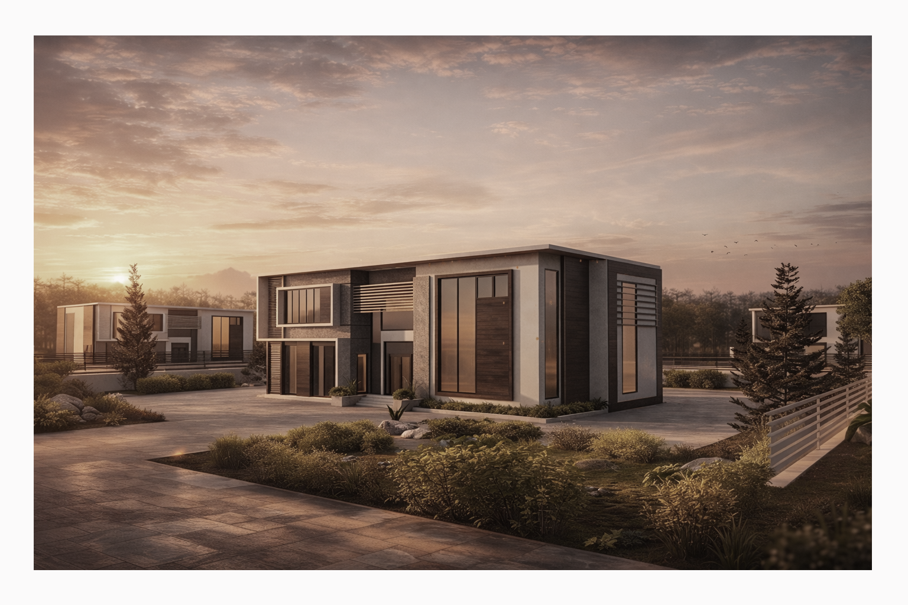
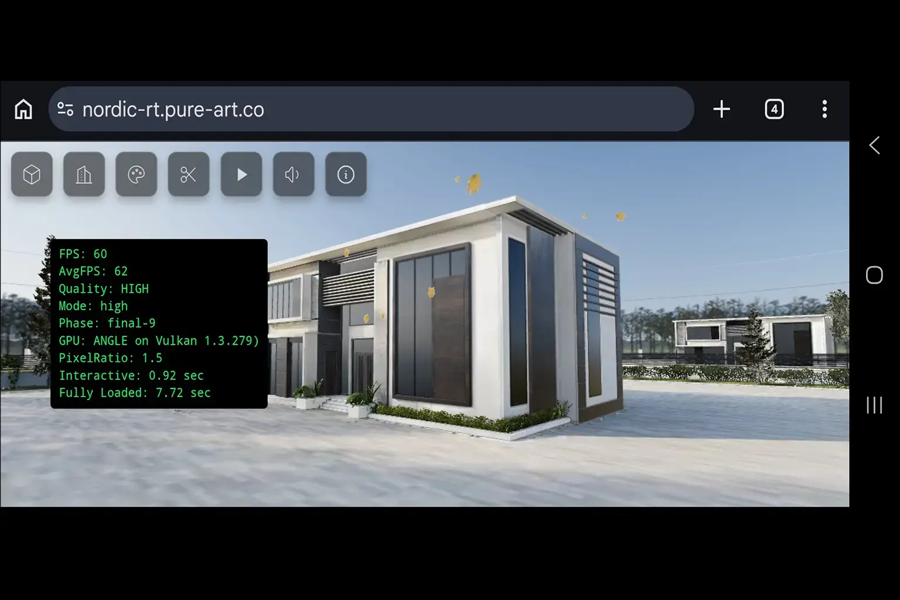
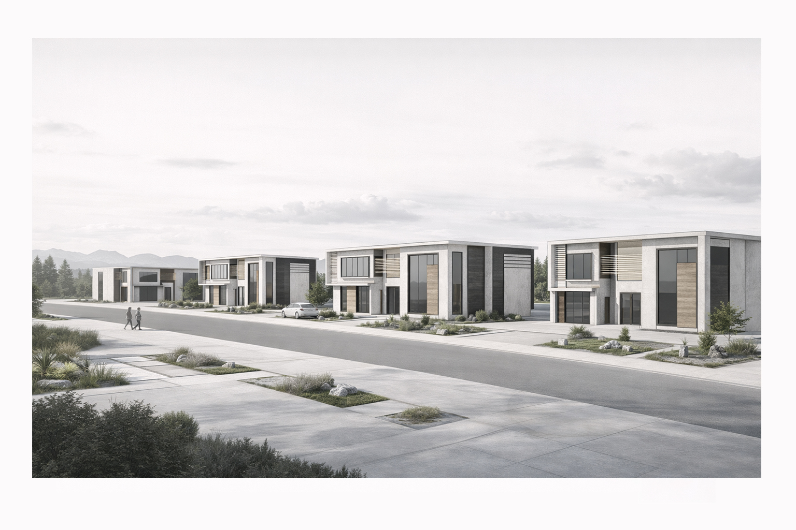
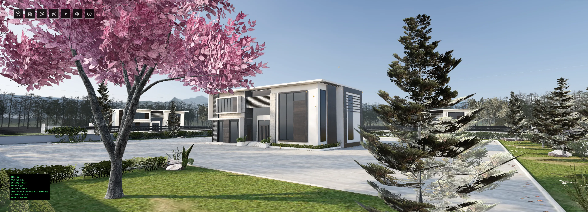
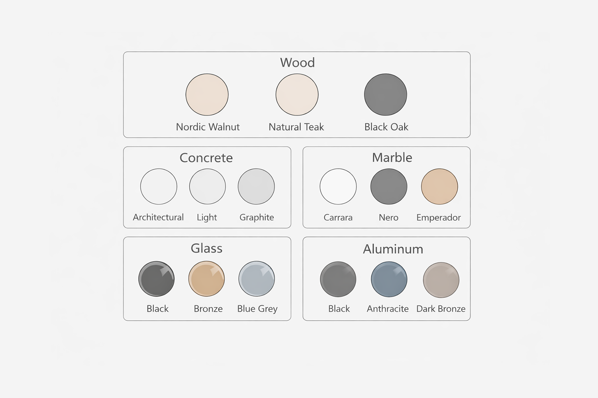
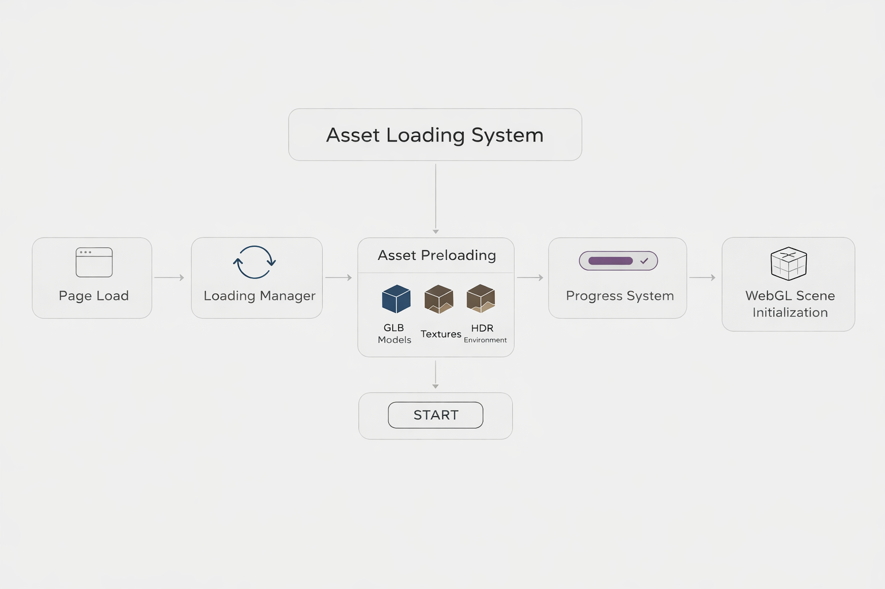
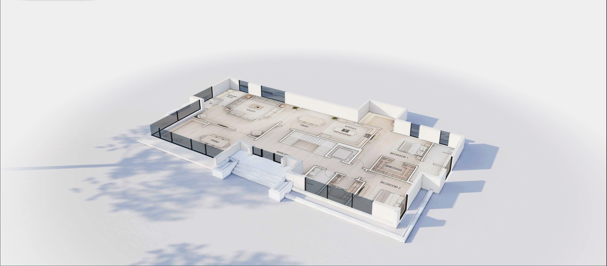
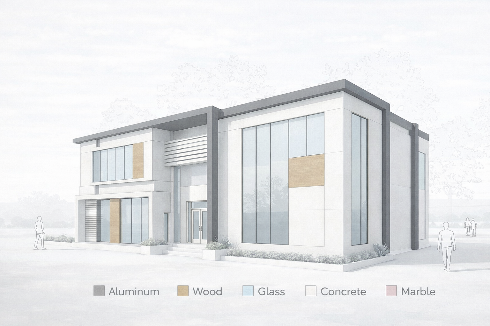
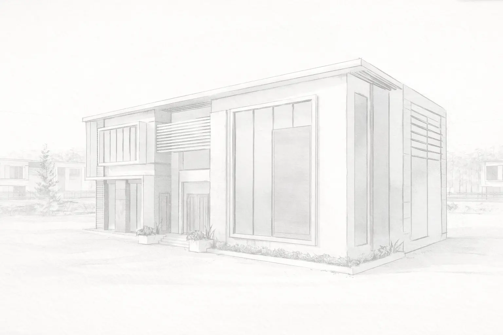

# Nordic RT — Real-Time Architectural Experience

🔗 Live Demo: https://nordic-rt.pure-art.co/  
📖 Full Case Study: https://pure-art.co/pages/Subpages/3d-viewer-02.html  

Real-time architectural visualization built with Three.js, focused on lighting, atmosphere, and performance across devices.

---

## Key Results

- 6 High-Fidelity Villas in a single real-time scene  
- ~2.5s initial load time  
- Stable ~60 FPS on mid-range mobile devices  
- Phase-based adaptive loading system  
- Real-time material interaction system  

---

## Performance Proof

Measured directly inside the application using real-time diagnostics:

- Stable ~60 FPS under full scene load  
- AvgFPS ~62 on tested Android devices  
- Adaptive pixel ratio system  
- Interactive in ~0.9s · Fully loaded in ~7.7s  

---

## Screenshots

### Exterior & Environment

### Interactive Features

### Materials & Details

---

## Project Overview

Nordic RT is a performance-driven real-time 3D architectural system built for the web.

The goal was not only to present a villa, but to deliver a complete interactive experience that remains stable across desktop and mobile devices.

---

## Core Systems

- Phase-based adaptive loading pipeline  
- Runtime performance-driven rendering decisions  
- Real-time material switching system  
- Controlled environment and lighting system  
- Scalable multi-villa scene design  

---

## Outcome

A production-ready WebGL system demonstrating that high-quality architectural visualization can run smoothly in the browser — including mobile devices — without sacrificing performance or usability.

---

## Notes

This repository is a simplified case study.  
Full implementation details are available in the external case study linked above.
